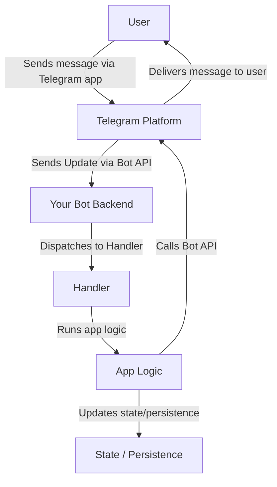

# 00 – Overview and Mental Model

## What you will build

This course will guide you through building a fully functional Telegram bot using Python and the `python‑telegram‑bot` framework.  You will start by creating an echo bot and gradually add commands, inline keyboards, callback queries, conversation state, persistence, admin commands, logging and deployment via webhooks.  By the end you will understand not just **how** to write the code, but **why** the Bot API behaves the way it does and how the backend fits together.

## Why this concept exists

Telegram’s official documentation explains the API surface but assumes you already understand backend concepts such as long polling, webhooks, state management and deployment.  Beginners often struggle with the practical questions: *Where does my code run?* *How do updates get to my bot?* *Why is my bot not responding?*  This tutorial fills that gap by providing a coherent mental model and step‑by‑step build path.

## Prerequisites

* A computer capable of running Python 3.13 or later.
* Basic familiarity with using a terminal/command prompt.
* A Telegram account to create a bot via BotFather.
* No prior Python or Telegram experience is required—the course covers environment setup from scratch.

## Code/files involved

This chapter does not involve code.  It introduces the core mental model that underlies the rest of the tutorial.  The diagrams referenced here are stored in `docs/diagrams/`.

## Run it

There is nothing to run for this chapter.  Instead, read through the mental model and study the diagrams to orient yourself before diving into code.

## Verify it

After reading this chapter, you should be able to explain the high‑level flow of a Telegram bot: how a user’s message becomes an update, how that update reaches your backend, how your code decides which handler to call and how the reply is sent back through the Bot API.

## What just happened

You learned why this tutorial exists and what it aims to teach.  You also encountered the core mental model that we will reinforce throughout the course.

## Common mistakes

- **Skipping the mental model.** It may be tempting to jump straight into coding, but understanding the flow of data will save hours of confusion later on.
- **Overlooking prerequisites.** Make sure you have Python installed and have access to your Telegram account before proceeding.

## Troubleshooting links

If you encounter errors during environment setup, refer to the [troubleshooting guide](troubleshooting.md).  Issues such as missing Python, invalid tokens or connectivity problems are addressed there.

## Where it fits in the lifecycle

This overview sits at the very beginning of the bot lifecycle.  Everything that follows—from reading updates via polling to deploying via webhooks—builds on the mental model introduced here.

## Next step

Continue to [01 – Absolute Zero Setup](01-absolute-zero-setup.md) to prepare your environment, obtain a bot token and set up your project folder.

## Mental model diagram

Below is the high‑level lifecycle of a Telegram bot.  The diagram is stored separately as a Mermaid file (`docs/diagrams/update-lifecycle.mmd`) and rendered by GitHub when viewed online.

This diagram illustrates the sequence: **User → Telegram update → bot backend → handler → app logic → state/persistence → Bot API call → Telegram → user**.  Keep this flow in mind as you progress through the stages.